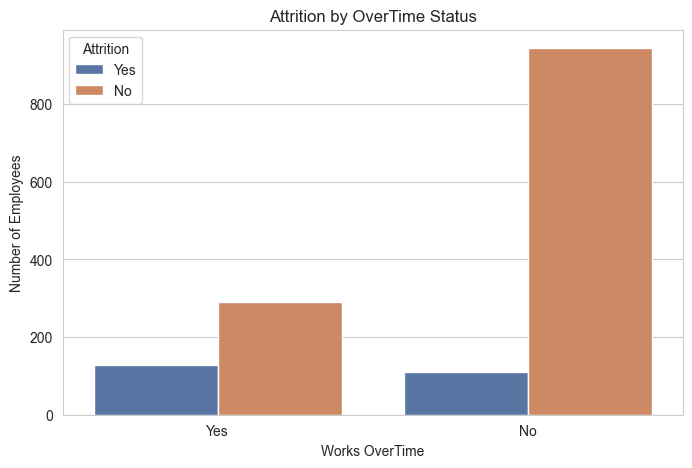
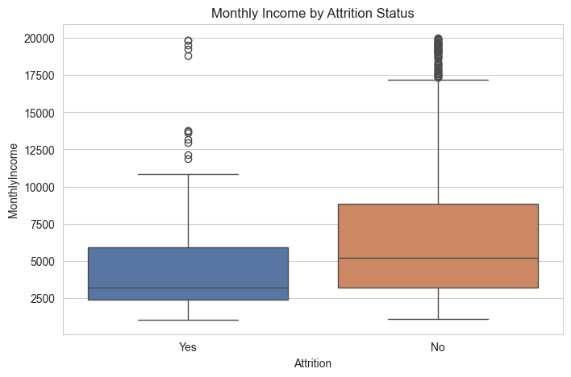
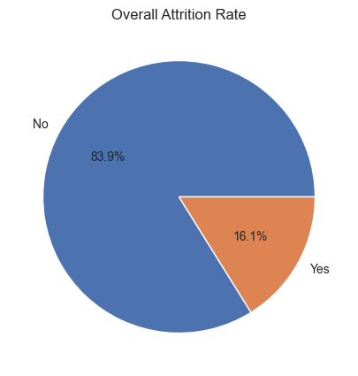

# Employee Attrition Analysis – ABC Manufacturing Ltd

**Data Science Internship Programme – AnalystLab Africa**
Week 1: Business Understanding & Data Exploration


## Overview

This project simulates a consulting engagement for **ABC Manufacturing Ltd**, which wants to
understand the drivers of employee attrition before investing in predictive machine learning
models. Using the IBM HR Analytics dataset (1,470 employees, 35 variables) as a stand-in for the
company's real HR data, this Week 1 deliverable focuses on business understanding, data
inspection, and exploratory data analysis.

## Dataset

**IBM HR Analytics – Employee Attrition & Performance**
[Kaggle link](https://www.kaggle.com/datasets/pavansubhasht/ibm-hr-analytics-attrition-dataset)
1,470 employees · 35 variables · no missing values · no duplicate rows

## Business Questions Addressed

1. What does the company's workforce look like?
2. Which departments have the highest employee attrition?
3. Does age influence attrition?
4. Does monthly income affect retention?
5. Does overtime influence attrition?
6. Which job roles experience the highest turnover?
7. Which variables appear important for future predictive modelling?

## Key Findings

| Attrition by Department | Attrition by OverTime |
|---|---|
|  |  |

| Monthly Income by Attrition | Overall Attrition Rate |
|---|---|
|  |  |

- Employees who work **overtime** leave at a substantially higher rate than those who don't.
- **Monthly income** is noticeably lower among employees who left.
- **Younger employees** show higher attrition than older, more tenured staff.
- **Sales Representatives** and **Laboratory Technicians** show the highest turnover by job role.
- Overall attrition rate: **16.1%** (237 of 1,470 employees).

## Project Structure

```
├── data/
│   ├── raw/              # Source dataset (untouched)
│   └── processed/        # Cleaned data (if applicable)
├── notebooks/
│   └── 01_week1_exploration.ipynb
├── reports/
│   ├── business_understanding_report.docx
│   ├── dataset_inspection_report.docx
│   └── reflection_report.docx
├── visuals/              # Exported charts (PNG)
├── docs/                 # Official assignment brief
├── requirements.txt
└── README.md
```

## Tech Stack

- Python 3.13
- pandas, numpy
- matplotlib, seaborn
- Jupyter Notebook

## Installation

```bash
python -m venv venv
venv\Scripts\Activate.ps1      # Windows
pip install -r requirements.txt
```

Then open `notebooks/01_week1_exploration.ipynb` in VS Code or Jupyter and select the `venv`
kernel.

## Deliverables

- [x] Business Understanding Report
- [x] Dataset Inspection Report
- [x] Jupyter Notebook (EDA + visualisations)
- [x] Reflection Report
- [ ] GitHub Repository (this repo)
- [ ] LinkedIn Post
- [ ] X Post
- [ ] Google Drive Link Submitted

## Author

**Caleb** — Data Science Intern, AnalystLab Africa