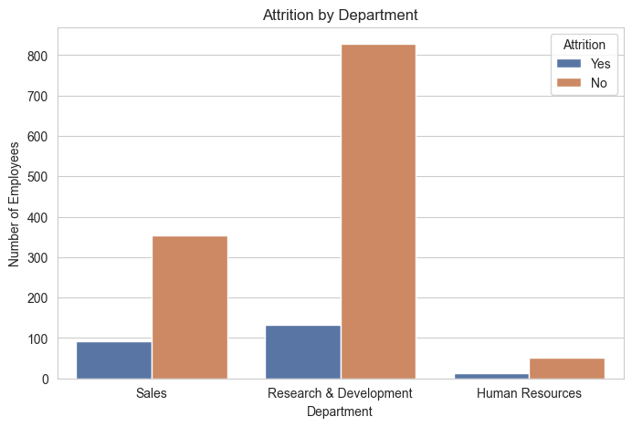

# Week 1 – Employee Attrition Analysis (ABC Manufacturing Ltd)

AnalystLab Africa – Data Science Internship Programme

First week, and mostly a warm-up: understand why attrition matters to a business before
touching any code, then explore the IBM HR Analytics dataset (1,470 employees) to see what
actually separates people who left from people who stayed.

The dataset turned out to be unusually clean — no missing values, no duplicates — which made
this more about picking the right chart for each question than about wrangling data. Overtime
and income were the two variables that stood out the most.

Overtime workers leave at a noticeably higher rate, income is lower on average among people who
left, and younger employees turn over more than older ones. Sales reps and lab technicians had
the highest turnover by role. Out of 1,470 employees, 237 left — about 16%.

## Files

- `notebooks/01_week1_exploration.ipynb`
- `reports/` — Business Understanding, Dataset Inspection, and Reflection reports
- `visuals/`

## Deliverables

Notebook, all three reports, GitHub repo, and both social posts are done. Google Drive link
still pending.
