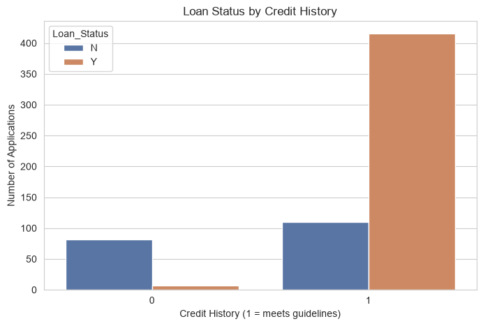
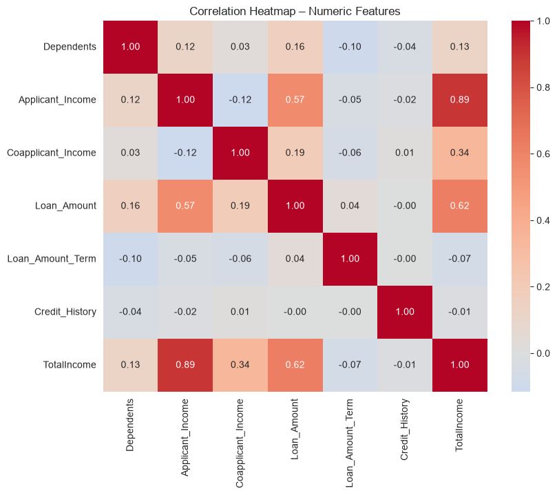

# Week 2 – Loan Prediction (Dream Housing Finance)

AnalystLab Africa – Data Science Internship Programme
**Week 2: Feature Engineering & Data Preprocessing for Machine Learning**

## Overview

Feature engineering and preprocessing on the Loan Prediction dataset (614 applications) to
turn raw applicant data into a machine-learning-ready dataset for predicting loan approval.

**Dataset:** [Loan Prediction Problem Dataset](https://www.kaggle.com/datasets/altruistdelhite04/loan-prediction-problem-dataset)
(originally an Analytics Vidhya practice problem) — 614 applications · 13 variables · missing values present

## Business Questions Addressed

1. Which features are most relevant to the prediction problem?
2. Which variables require encoding?
3. Which variables require scaling or normalization?
4. Are there any redundant or highly correlated features?
5. How should missing values and outliers be handled?
6. What preprocessing techniques improve the dataset quality?
7. Is the dataset ready for machine learning?

## Key Steps Applied

- Missing value imputation (mode / median depending on variable type)
- Data type correction and feature engineering (`TotalIncome`)
- Outlier capping using the IQR method
- Label Encoding (binary categorical variables) + One-Hot Encoding (`Property_Area`)
- StandardScaler on numeric features
- Feature selection via correlation heatmap (dropped redundant income columns)

## Key Findings

| Loan Status by Credit History | Correlation Heatmap |
|---|---|
|  |  |

- **Credit History** is by far the strongest predictor of loan approval.
- **Semiurban** applicants are approved at a higher rate than urban or rural applicants.
- Final dataset: 614 rows × 12 columns, fully numeric, no missing values.

## Project Structure

```
├── data/
│   ├── raw/                    # Source dataset
│   └── processed/
│       ├── loan_cleaned.csv    # Cleaned, human-readable
│       └── loan_ml_ready.csv   # Encoded, scaled, ML-ready
├── docs/                       # Official assignment brief
├── notebooks/
│   └── 02_week2_preprocessing.ipynb
├── reports/
│   ├── business_understanding_report.docx
│   └── data_preprocessing_report.docx
└── visuals/                    # Exported charts (PNG)
```

## Deliverables

- [x] Business Understanding Report
- [x] Data Preprocessing Report
- [x] Cleaned Dataset (.csv)
- [x] Machine Learning Ready Dataset (.csv)
- [x] Jupyter Notebook
- [x] GitHub Repository Updated
- [x] LinkedIn Post Published
- [x] X Post Published
- [x] Google Drive Link Submitted