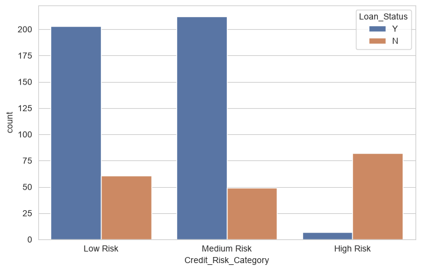

# Week 3 – Advanced Analysis, Statistical Testing & Feature Engineering

AnalystLab Africa – Data Science Internship Programme

This week continues directly from Week 2's cleaned Loan Prediction dataset — no re-cleaning,
just deeper analysis on top of it. The goal was to stop trusting what the charts "look like"
and actually test whether those patterns hold up statistically, then use that to decide which
features are worth engineering.

## What this covers

Advanced EDA (numerical, categorical, bivariate, multivariate), five statistical tests, four
engineered features, and a proper feature evaluation pass before producing the final dataset
that Week 4's modelling will build on.

## What actually came out of it

Credit history is, by a wide margin, the strongest and only consistently significant driver of
approval — a Chi-Square test put that beyond doubt (p < 0.001). Property area matters too,
though more moderately. The genuinely surprising part: neither income nor the requested loan
amount showed a statistically significant difference between approved and rejected applicants
on their own — a t-test and a Mann-Whitney U test both came back non-significant. That result
shaped most of the feature engineering that followed, since it meant "how much someone earns"
mattered less than "how that amount relates to what they're asking for."

The four engineered features (Debt_to_Income_Ratio, Family_Size, Balance_Income,
Credit_Risk_Category) were built around that finding. Credit_Risk_Category in particular ended
up separating approved from rejected applicants almost as cleanly as raw credit history does.

## Files

- `notebooks/03_week3_advanced_analysis.ipynb`
- `data/processed/loan_final_cleaned_w3.csv` — cleaned dataset with engineered features, still human-readable
- `data/processed/loan_ml_ready_w3.csv` — encoded and scaled, ready for modelling (614 rows, 16 columns)
- `reports/` — Project Continuity Summary, Statistical Analysis Summary, Feature Engineering Documentation, Feature Evaluation and Selection Summary, Business Insights and Recommendations Report, updated Data Dictionary
- `visuals/`

## Deliverables

Notebook, all six reports, both processed datasets, and the GitHub repo are done. LinkedIn/X
posts and the Google Drive folder are still pending.
