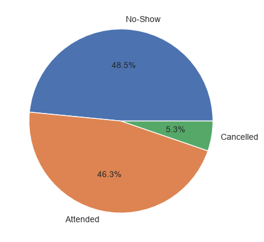

# HealthConnect Experience Lab

AnalystLab Africa Experience Lab Internship – Data Science Track

HealthConnect Clinic is a fictional healthcare provider losing appointment slots to patients who
don't show up, with no advance warning to act on. This project explores whether the clinic's
appointment data can support a model that flags at-risk appointments ahead of time, and
progresses week by week from problem definition toward an actual baseline model.

## Where things stand

**Week 4 — problem definition.** Looked at the 5,000-record appointment dataset, confirmed what
each column means against the data dictionary, and worked out a defensible target definition.
The three appointment outcomes (Attended, No-Show, Cancelled) aren't a clean binary split —
cancelling is a patient proactively communicating, not the same failure mode as silently missing
an appointment — so the proposed model treats it as No-Show vs. Attended, with Cancelled
appointments set aside for now rather than folded into either class.

One data quality issue came up worth flagging: `waiting_time_minutes` is populated even for
appointments that were never attended, which isn't possible in a real clinic. Beyond being a
data artefact, it's also not information you'd have before an appointment happens, so it's
excluded as a candidate feature regardless.

`previous_no_shows` looks like the most promising signal so far — its average is noticeably
higher among appointments that ended in a no-show than among those attended.

## Files

- `notebooks/week4_initial_data_assessment.ipynb`
- `reports/ml_problem_definition_document.docx`
- `reports/week4_project_summary.docx`
- `docs/` — data dictionary, clinic knowledge base, assignment brief

## Notes for later weeks

Patient IDs repeat across appointments, so any train/test split needs to happen at the patient
level, not the appointment level, or model performance will look better than it actually is.

## Author

Caleb Djarabé — Data Science Track, AnalystLab Africa Experience Lab
